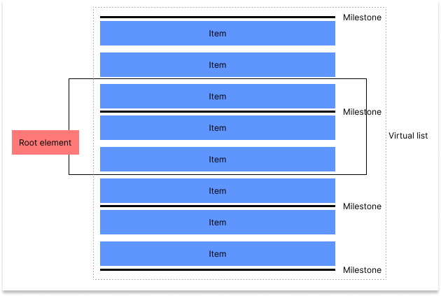

# Virtual List By Milestones
## Introduction
This component is built to be able to render a massive amount of item in a list.

Every item should not be to big that take a long time to render.

At one time, only a small amount of items will be rendered, the others will be faked by big div elements (they are called avatar) spanning the space supposed to be occupied by those not rendered items.

Let look at the picture below

+ The root element is the scrolling container, it holds the virtual list component (if not specified, default to document element)
+ Virtual list  component returns a fragment containing all the items  
+ Milestones are inserted into the list, 2 adjacent milestones will make up an interval containing an amount of items
+ Intervals which overlap the root element will be rendered, others are faked by a big div element (they are called avatar) spanning the space supposed to be occupied by the interval




## Examples
```javascript
<VirtualList
    direction="column"
    renderItem={renderItem}
    itemElementType="div"
    itemCountBetweenTwoMilestones={20}
    data={dataList}
    intersectionOptions={{
        root: listRef.current,
    }}
/>
```
+ direction: The optional property, indicate direction of the list
+ data: An array of item data
+ renderItem: A function that receive an item of data array and return the rendered item
+ itemElementType: The optional property, indicate the element type of the milestone component
+ intersectionOptions: Optional property, you can set the root element and the root margin. Root margin should > 300px, larger value will make more item being rendered.